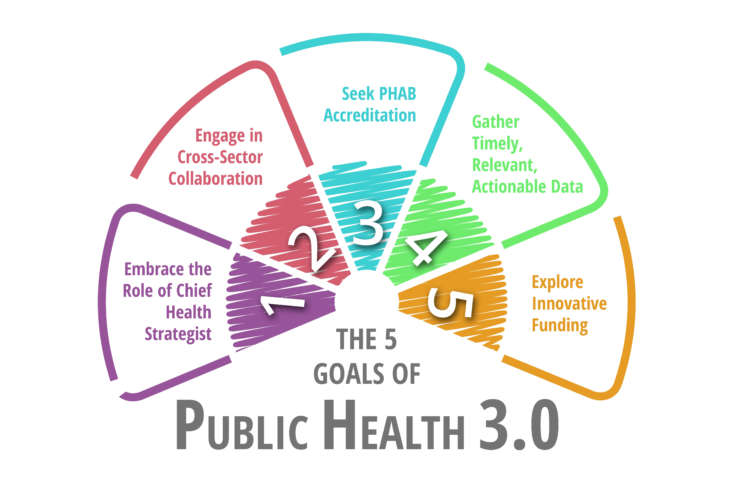

    

## Overview
Last semester, I did several data science projects in the field of public health, doing some exploratory analyses, model building and results interpretation with some public health data.

    

## Project 1 Phthalate-obesity
Plasticizers, mainly phthalates, can interrupt endocrine system even if at very low level of exposure, and there is evidence of plasticizers depositing in animal brain. Concerns have been rising in pediatricians and scientists. Obesity, which is a major public health problem across the world, is also associated with plasticizer exposure. 

First fat and now sugar have been blamed for causing obesity, while increasing evidence shows that plasticizer pollution is also playing an important role. However, effects of plasticizers on bodyweight within different age and gender groups are different. With more detailed exposure monitoring data of plasticizer exposure available at NHANES datasets, we can now explore the relationship between body weight and plasticizer exposure.

You can click into this [website](https://hh2767.github.io/p8105_final.github.io/index.html)  to take a look at the whole project.

    

## Project 2 Predict Cancer Mortality
Cancer is among the leading causes of death globally. There are many factors related to cancer mortality, including socioeconomic status, age, race and so on. In this project, we aimed to build a multiple linear regression model to predict cancer mortalities of different counties in the United States. In the final model, we chose six variables mainly related to education level, race, employment status, income or incidence rate as our predictors. As a result, our final model has a certain predictive ability.

You can click into this [page](cancer.html) to take a look at the whole project.
